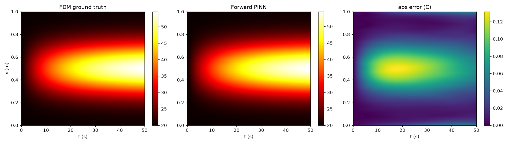
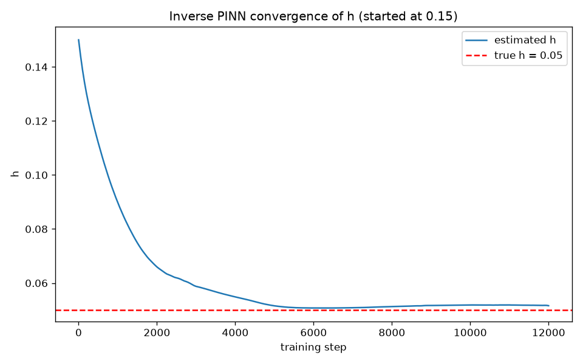
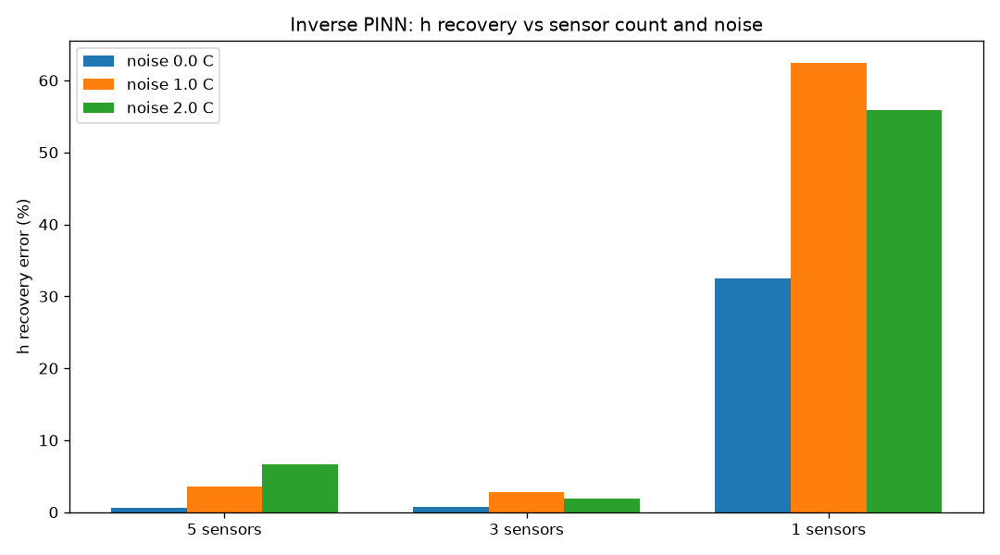
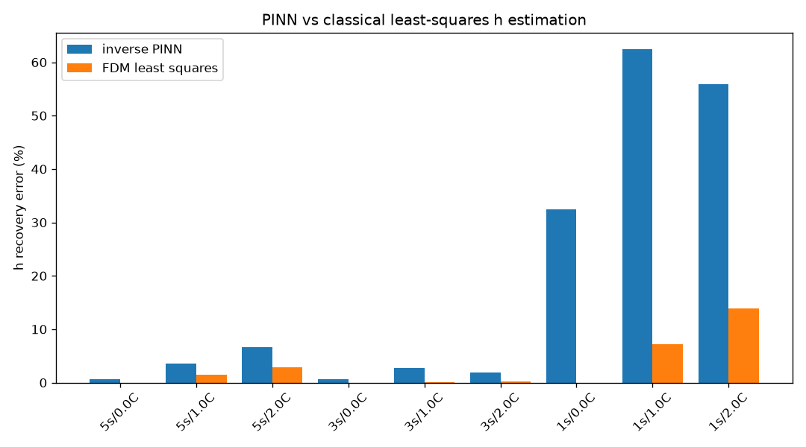

# PINN Heat-Diffusion Model for Neon/LED Tube Thermal Behavior

Physics-informed neural networks for predicting the temperature profile of a
neon/LED tube along its length, and for estimating the convective heat transfer
coefficient from a handful of noisy sensor readings.

## Why

Instrumenting every tube prototype with a full thermal camera rig is expensive.
If you glue 3 thermocouples to a tube you get sparse, noisy point readings.
A PINN can fuse those sparse readings with the known physics (the heat equation)
and reconstruct the full temperature field AND estimate unknown physical
parameters like the convective cooling coefficient. No large dataset needed.

## The physics

1D transient heat equation with convective loss and an internal heat source:

```
dT/dt = alpha * d2T/dx2 - h * (T - T_ambient) + Q(x)
```

- `T(x,t)` temperature along the tube, degrees C
- `alpha = 1e-4` thermal diffusivity
- `h = 0.05` convective heat transfer coefficient (unknown in the inverse problem)
- `Q(x)` Gaussian heat source centred mid-tube (peak 2.0, width 0.15)
- `T_ambient = 20 C`, tube length `L = 1 m`, simulated for 50 s

Boundary conditions: insulated ends (Neumann, dT/dx = 0 at x=0 and x=L).
Initial condition: tube starts at ambient everywhere.

## Ground truth

`fdm_reference.py` solves the PDE with explicit finite differences
(forward Euler + central difference, CFL-safe step). The solver is validated
against the analytical Gaussian-spreading solution for pure diffusion in
`validate_fdm.py` (0.8% L2 error, PASS). Every PINN result below is graded
against this FDM solution, never against the PINN itself.

## Method

### Forward PINN (physics only, zero data)

`train_forward.py`. A small MLP maps (x, t) to T. Two hard constraints are
baked into the architecture instead of being soft loss penalties:

- inputs enter as `cos(k*pi*x/L)` features, so dT/dx is exactly zero at both
  tube ends - the Neumann BC cannot be violated, no BC loss term exists
- the output is multiplied by `(1 - exp(-t/tau))`, so T(x,0) is exactly
  ambient - the IC cannot be violated, no IC loss term exists

That leaves a single loss term (the PDE residual via autograd), which removed
the loss-balancing failure mode entirely. See FAILED_APPROACHES.md for the
soft-constraint versions that plateaued at 29% error and why.

Optimizer: Adam 12k steps with step decay, then L-BFGS fine-tune.

### Inverse PINN (sparse noisy data, unknown h)

`train_inverse.py`. Same architecture, but `h` becomes a learnable parameter
(softplus-wrapped to stay positive) optimized jointly with the network from a
deliberately wrong initial guess (0.15, i.e. 3x the true value). Loss =
PDE residual + 10x data misfit on the sensor readings. Sensor readings are
sampled from the FDM ground truth at 3 x-positions and 8 times, with 1 C
Gaussian noise added to mimic real thermocouples.

## Results

### Forward PINN vs FDM (no data at all, physics only)

| metric | value |
|---|---|
| relative L2 error over the full (x,t) grid | **0.17%** |
| max absolute error anywhere | 0.13 C |
| final PDE residual | 5.9e-07 |



The soft-constraint version of this exact network was stuck at 29% error.
The hard-constraint rewrite (cos features + time envelope) fixed it in one
training run. Full story in FAILED_APPROACHES.md.

### Inverse PINN: recovering h from sparse noisy sensors

Headline case - 3 simulated thermocouples, 8 readings each, 1 C Gaussian
noise, h initialized at 0.15 (3x wrong):

| | h |
|---|---|
| true | 0.05 |
| recovered | 0.05161 |
| error | **3.23%** |



### Sensitivity: sensors x noise, PINN vs classical least-squares

h recovery error (%), single seed per cell:

| sensors | noise (C) | inverse PINN | FDM least-squares |
|---|---|---|---|
| 5 | 0.0 | 0.65 | 0.00 |
| 5 | 1.0 | 3.50 | 1.41 |
| 5 | 2.0 | 6.68 | 2.81 |
| 3 | 0.0 | 0.68 | 0.00 |
| 3 | 1.0 | 2.76 | 0.14 |
| 3 | 2.0 | 1.93 | 0.27 |
| 1 | 0.0 | 32.44 | 0.00 |
| 1 | 1.0 | 62.45 | 7.21 |
| 1 | 2.0 | 55.92 | 13.91 |




Two honest readings of this table:

1. **Three sensors are enough, one is not.** With 3+ sensors the PINN pins h
   within a few percent even at 2 C noise. A single off-center sensor makes
   the problem badly under-determined for the PINN (30-60% error).
2. **The classical baseline wins on pure h accuracy here, and that is
   expected.** Least-squares fitting has an unfair advantage in this toy
   setup: it uses the exact FDM forward model, the exact Q(x), and re-solves
   the PDE dozens of times per fit. When the forward model is perfectly known
   and cheap, classical fitting is the right tool. The PINN earns its keep
   where that stops being true: it simultaneously reconstructs the full
   temperature field, needs no repeated forward solves, and extends naturally
   to partially-unknown physics (unknown Q, spatially-varying h). Claiming
   the PINN "beats" least-squares on this table would be dishonest; it does a
   different, bigger job at competitive parameter accuracy.

Also noted: the 3-sensor/2C cell beating the 1C cell is single-seed noise
luck - a proper study would average multiple noise realizations per cell.

### Baseline bake-off: same sparse data, full-field reconstruction

24 noisy observations (3 sensors x 8 times, 1 C noise):

| model | uses physics | full grid rel L2 | max abs error (C) |
|---|---|---|---|
| forward PINN | yes | **0.17%** | 0.13 |
| data-only NN | no | 20.7% | 20.6 |
| LSTM | no | 37.3% | 54.2 |

The data-only NN interpolates the 24 points and invents nonsense everywhere
else. The LSTM never sees spatial structure at all, so asking it about new x
positions fails completely (54 C errors). The PINN fills the gaps with the
PDE, which is the entire point of the method.

## Honest limitations

- 1D along the tube, not 2D radial - no cross-section temperature structure
- ground truth is a numerical solver, not physical sensor data
- radiative losses ignored, convection linearized with a single constant h
- the heat source Q(x) is a synthetic Gaussian, not measured drive power
- the envelope time constant tau is fixed; in the forward model it is set to
  1/h which mildly encodes prior knowledge of the cooling rate (the inverse
  model uses a generic tau=15 so the true h does not leak into it)

## What I'd do differently / extensions

- 2D (x, r) model of the tube cross-section
- ensemble PINNs for uncertainty bands on the recovered h
- validate against a real tube with actual thermocouples
- swap the synthetic Q for drive-current-derived power density

## Repo layout

```
fdm_reference.py        ground truth FDM solver
validate_fdm.py         solver vs analytical solution check
problem.py              shared physical constants + sensor sampling
pinn_model.py           HardPINN (hard-constraint) + plain PINN
losses.py               PDE residual, BC/IC/data losses
train_forward.py        phase 2, forward problem
train_inverse.py        phase 3, inverse h recovery
sensitivity_study.py    h recovery vs sensor count x noise
baselines/
  least_squares_h.py    classical FDM-fit baseline for h
  data_only_nn.py       same net, no physics loss
  lstm_baseline.py      sequence model, no physics
plot_*.py               figure generation
figures/  results/      outputs
FAILED_APPROACHES.md    dead ends, so nobody retries them
```

## Run it

```
pip install -r requirements.txt
python3 validate_fdm.py
python3 train_forward.py
python3 train_inverse.py
python3 sensitivity_study.py
python3 baselines/least_squares_h.py
python3 baselines/data_only_nn.py
python3 baselines/lstm_baseline.py
```

Everything trains on CPU in minutes.
